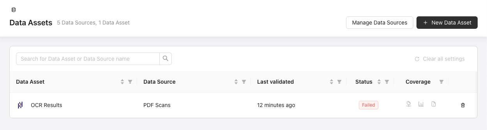
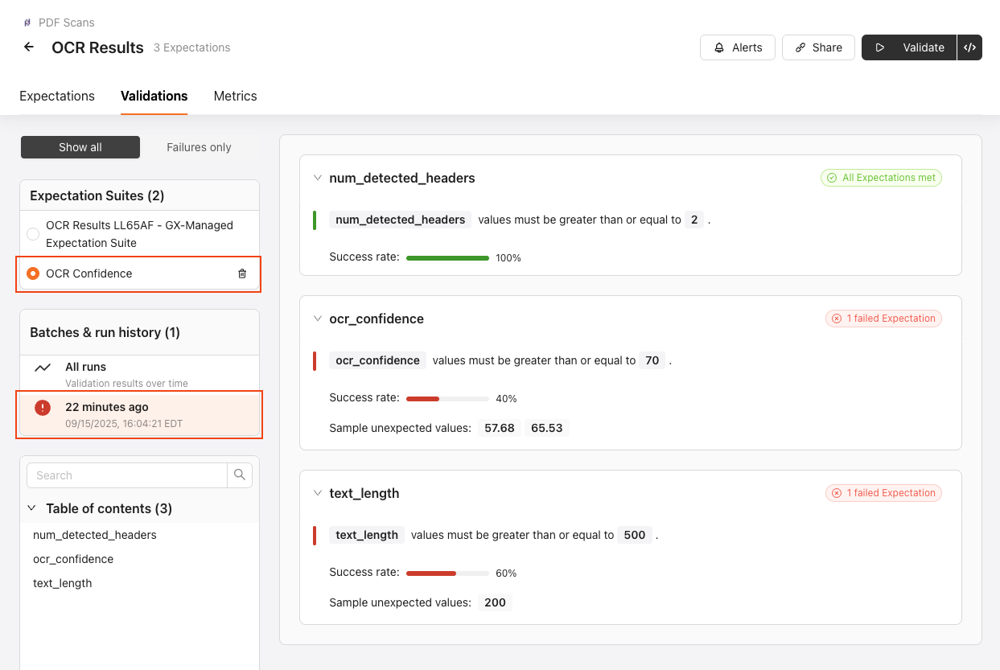

This tutorial provides a working, hands-on example of how to validate unstructured data using sample PDF data using GX Cloud. The generated metadata during the OCR process on a PDF contains information like confidence scores, word counts, etc. GX Cloud allows you to set up data quality checks on this metadata to maximize the confidence in your unstructured data, all while allowing your entire organization to view the results. 

## Prerequisites

- [Python version 3.9 to 3.12](https://www.python.org/downloads/)
- Bash shell
- A code editor
- A [GX Cloud account](https://greatexpectations.io/cloud)
- Your [Cloud user access token and Cloud organization ID](/cloud/connect/connect_python.md#get-your-user-access-token-and-organization-id) saved in your [environment variables](/cloud/connect/connect_python.md#set-the-gx-cloud-organization-id-and-user-access-token-as-environment-variables)

## Step 1: Install dependencies

Open a terminal window and navigate to the folder you want to use for this tutorial.

Install [poppler](https://poppler.freedesktop.org/) and [tesseract](https://github.com/tesseract-ocr/tesseract).

```bash
brew install poppler
brew install tesseract
```

Optional. Create a Python virtual environment and start it.

```bash
python -m venv my_venv
source my_venv/bin/activate
```

Install the Python libraries that you will use in this tutorial, including the Great Expectations library.

```bash
pip install datasets
pip install pdf2image
pip install pytesseract
pip install great_expectations
```

Create the Python file for this project.

```bash
touch gx_unstructured_data.py
```

## Step 2: Import the required Python libraries

Open the Python file in your code editor of choice. 

Import the libraries you will be using in this tutorial.

```python title="Python" name="docs/docusaurus/docs/reference/learn/data_quality_use_cases/unstructured_data/unstructured_data.py - import the libraries"
```

## Step 3: Load the dataset and convert it into a dataframe

This tutorial uses the [broadfield-dev/pdf-ocr-dataset Hugging Face open source data set](https://huggingface.co/datasets/broadfield-dev/pdf-ocr-dataset). You will convert the first page of each PDF into an image, run OCR on that  page and finally extract the metrics from it.

Load the dataset.

```python title="Python" name="docs/docusaurus/docs/reference/learn/data_quality_use_cases/unstructured_data/unstructured_data_process_files.py - load the dataset"
```

Iterate through the PDFs, converting the first page into an image before running OCR and storing the metrics.

```python title="Python" name="docs/docusaurus/docs/reference/learn/data_quality_use_cases/unstructured_data/unstructured_data_process_files.py - iterate through the data"
```

Convert the metrics into a dataframe for validation.

```python title="Python" name="docs/docusaurus/docs/reference/learn/data_quality_use_cases/unstructured_data/unstructured_data.py - convert the data into a dataframe"
```

## Step 4: Initialize a GX Data Context and related GX entities
In this tutorial, you will connect to your GX Cloud organization using the GX Cloud API. You will either get or create a pandas Data Source and a dataframe Data Asset. The batch definition will use the whole dataframe that you created in the previous step.

Instantiate the GX Data Context and get or create the Data Source, Data Asset and Batch Definition.
```python title="Python" name="docs/docusaurus/docs/reference/learn/data_quality_use_cases/unstructured_data/unstructured_data.py - create the GX entities"
```

Get or create an Expectation Suite and create Expectations to validate the metrics generated from the PDFs. This tutorial utilizes the ExpectColumnValuesToBetween Expectation in order to validate that the metrics we stored in the dataframe meet our parameters. You can also try using different Expectations or value ranges.

```python title="Python" name="docs/docusaurus/docs/reference/learn/data_quality_use_cases/unstructured_data/unstructured_data.py - create the expectation suite"
```

## Step 5: Create a Validation Definition and create and run the Checkpoint
GX uses a Validation Definition to link the Batch Definition and Expectation Suite. The Checkpoint will be used to execute Validations so that you can view the results through the GX Cloud UI.

```python title="Python" name="docs/docusaurus/docs/reference/learn/data_quality_use_cases/unstructured_data/unstructured_data.py - create the vd and run the checkpoint"
```

## Step 6: Review the Results
Now that you have set up the Data Source, Data Asset, Expectations and have run the Checkpoint, the Validation results can be viewed in your GX Cloud organization. 

Log into GX Cloud, navigate to the Data Assets page and find the Data Asset that we used earlier in the tutorial.



Click into the Data Asset and then to the Validations tab. Select the Expectation Suite that was created above and then select the specific Validation result that was just run.



## The path forward
Using this tutorial as a framework, you can try plugging in your own unstructured data, as well as add other Expectations from the [Expectation Gallery](https://greatexpectations.io/expectations) to the Expectation Suite. Finally, validating your unstructured data can also be done within a data pipeline, so executing this code using an orchestrator should be explored as well.

Ensuring the quality of your unstructured data is essential for businesses that rely on it, but this is only one of many data quality issues that is relevant to your organization. Explore our other [data quality use cases](/reference/learn/data_quality_use_cases/dq_use_cases_lp.md) for more insights and best practices to expand your data validation to encompass key quality dimensions.