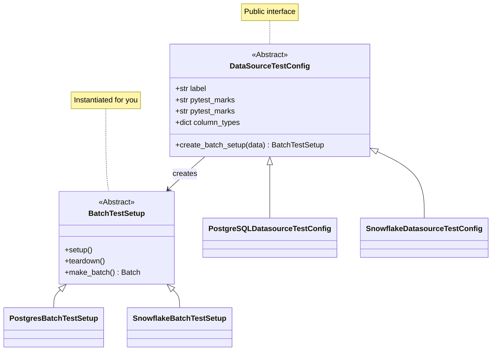
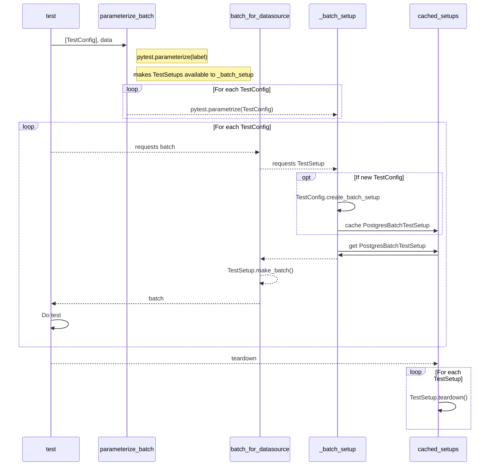

## Overview of the primary classes

```mermaid
classDiagram
    class DataSourceTestConfig
    class BatchTestSetup

    DataSourceTestConfig <|-- PostgreSQLDatasourceTestConfig
    DataSourceTestConfig <|-- SnowflakeDatasourceTestConfig
    BatchTestSetup <|-- PostgresBatchTestSetup
    BatchTestSetup <|-- SnowflakeBatchTestSetup

    <<Abstract>> DataSourceTestConfig
    <<Abstract>> BatchTestSetup

    note for DataSourceTestConfig "Public interface"
    note for BatchTestSetup "Instantiated for you"

    DataSourceTestConfig : +str label
    DataSourceTestConfig : +str pytest_marks
    DataSourceTestConfig : +str pytest_marks
    DataSourceTestConfig : +dict column_types
    DataSourceTestConfig : +create_batch_setup(data) BatchTestSetup

    BatchTestSetup  : +setup()
    BatchTestSetup  : +teardown()
    BatchTestSetup  : +make_batch() Batch

    DataSourceTestConfig  --> BatchTestSetup: creates
```

## Overview of the main flow

```mermaid
sequenceDiagram
    participant test
    participant parameterize_batch
    participant batch_for_datasource
    participant _batch_setup
    participant cached_setups

    test->>parameterize_batch: [TestConfig], data
    note right of parameterize_batch: pytest.parameterize(label)
    note right of parameterize_batch: makes TestSetups available to _batch_setup
    loop For each TestConfig
        parameterize_batch-->>_batch_setup: pytest.parametrize(TestConfig)
    end

    loop For each TestConfig
        test-->>batch_for_datasource: requests batch
        batch_for_datasource-->>_batch_setup: requests TestSetup
        opt If new TestConfig
            _batch_setup->>_batch_setup: TestConfig.create_batch_setup
            _batch_setup->>cached_setups: cache PostgresBatchTestSetup
        end
        _batch_setup->>cached_setups: get PostgresBatchTestSetup
        cached_setups->>_batch_setup:
        _batch_setup-->>batch_for_datasource:
        batch_for_datasource-->>batch_for_datasource: TestSetup.make_batch()
        batch_for_datasource-->>test: batch
        test->>test: Do test
    end

    test-->>cached_setups: teardown
    loop For each TestSetup
        cached_setups->>cached_setups: TestSetup.teardown()
    end

```
